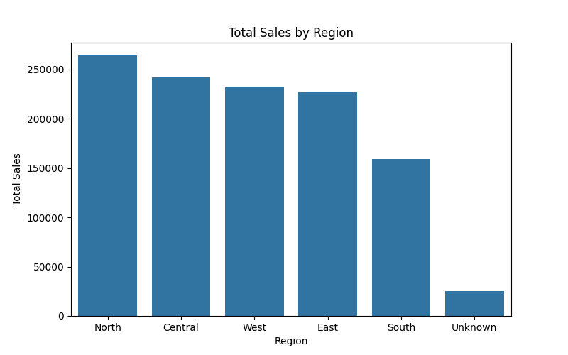
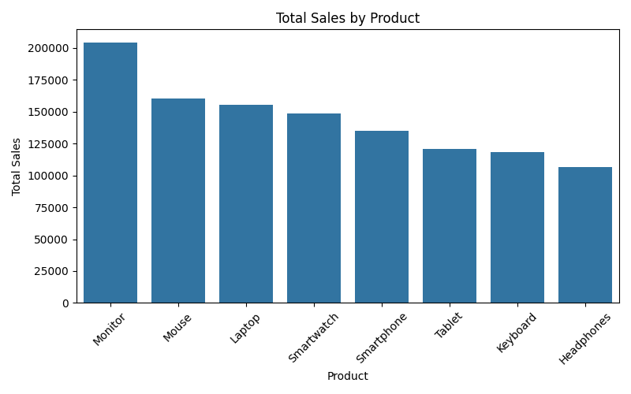
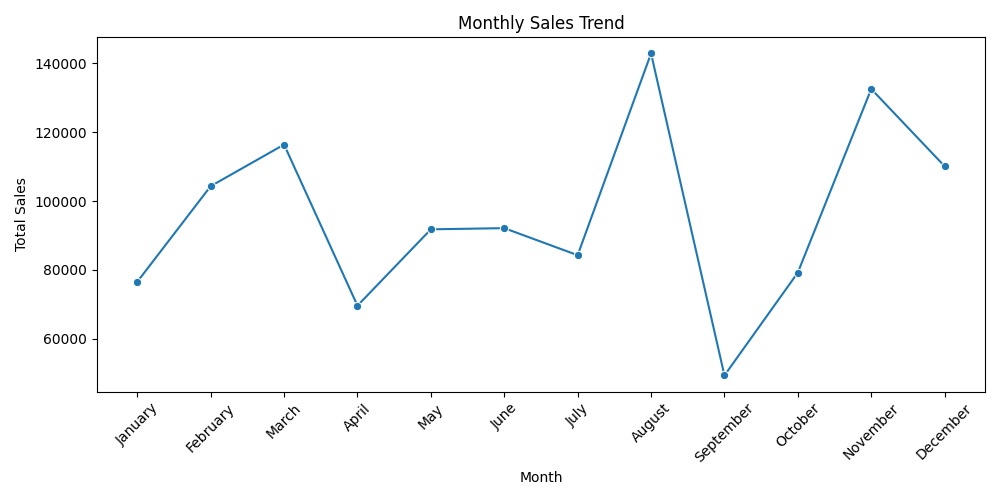
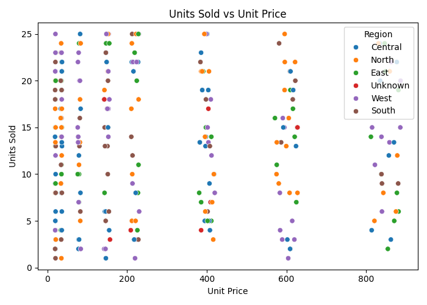
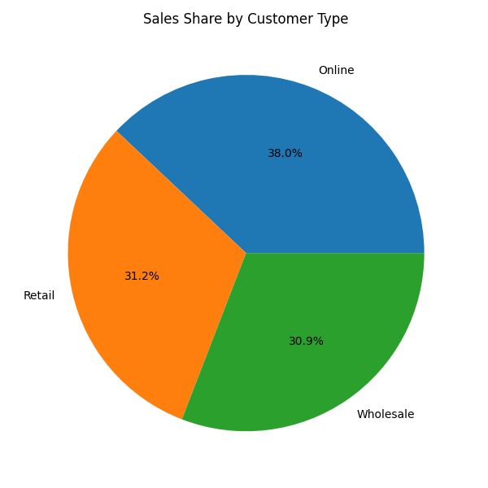

# Sales Data Analysis — Python (EDA)

## Overview
This project performs exploratory data analysis (EDA) on the same retail sales dataset used in the Excel and SQL projects, this time using Python. It goes beyond the earlier analyses by adding correlation analysis and a customer-segment breakdown, and demonstrates the ability to build a repeatable, code-based analysis pipeline.

## Tools Used
- Python
- Pandas (data manipulation)
- Matplotlib & Seaborn (visualization)

## Dataset
- `sales_data_clean.csv` — 300 cleaned retail sales records (Date, Region, Product, Category, Units Sold, Unit Price, Customer Type, Total Sales)

## Analysis Performed

### 1. Data Exploration & Quality Check
Used `.info()`, `.describe()`, and `.isnull().sum()` to confirm the dataset was clean (no missing values, correct data types) before analysis.

### 2. Sales by Region
Grouped and summed sales by region, visualized as a bar chart. North led with **$264,114**, followed by Central and West.

### 3. Sales by Product
Grouped and summed sales by product. Monitors generated the highest total revenue at **$204,395**.

### 4. Monthly Sales Trend
Extracted month from the date field and plotted revenue over time. August was the peak month; September saw the sharpest decline of the year.

### 5. Correlation: Unit Price vs. Units Sold
Calculated the correlation coefficient between unit price and units sold to check whether higher-priced items sold in smaller quantities. Visualized with a scatter plot colored by region.

### 6. Sales Share by Customer Type
Broke down revenue contribution across Retail, Wholesale, and Online customer segments using a pie chart — a segment-level view not covered in the earlier Excel/SQL analyses.

## Skills Demonstrated
- Data loading and inspection with Pandas
- Grouping and aggregation (`groupby`, `sum`)
- Date handling (extracting month/year from timestamps)
- Correlation analysis
- Data visualization with Matplotlib and Seaborn (bar, line, scatter, pie charts)
- Writing a reusable, script-based analysis workflow (vs. manual point-and-click tools)

## Files in This Repository
- `analysis.py` — Full Python script for the analysis
- `sales_data_clean.csv` — Dataset used
- `region_sales.png`, `product_sales.png`, `monthly_trend.png`, `price_vs_units.png`, `customer_type_share.png` — Output charts
